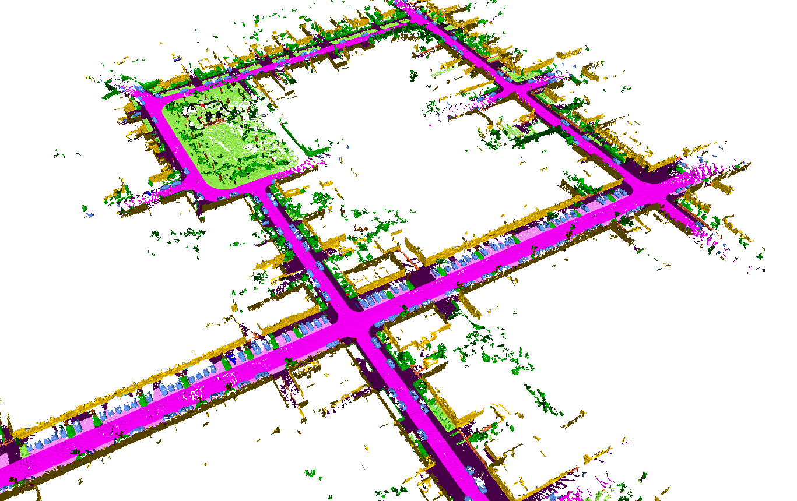
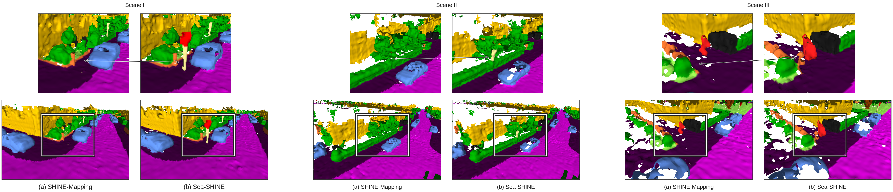

# 🌊🌟 Sea-SHINE: Semantic-Aware 3D Neural Mapping

<!-- Image -->
<p align="center">
   
</p>
KITTI 00 semantic map reconstructed by Sea-SHINE. The map is colored by the semantic labels of the points. The map is reconstructed using the semantic-aware decoder with FiLM conditioning.

## Table of Contents
- [🌊🌟 Sea-SHINE: Semantic-Aware 3D Neural Mapping](#-sea-shine-semantic-aware-3d-neural-mapping)
  - [Table of Contents](#table-of-contents)
  - [Overview](#overview)
  - [Features](#features)
  - [Installation](#installation)
    - [Version compatibility](#version-compatibility)
  - [Usage](#usage)
  - [Configuration](#configuration)
  - [License](#license)
  - [Contact](#contact)
  - [Acknowledgements](#acknowledgements)

## Overview
Sea-SHINE is an innovative approach that integrates semantic information within a [SHINE-mapping](https://github.com/PRBonn/SHINE_mapping) framework, enhancing the utility and navigational relevance of 3D maps for large-scale environments. This repository contains the code for Sea-SHINE, which leverages dual decoders and a semantic awareness module, utilizing Feature-wise Linear Modulation (FiLM) to condition mapping on semantic labels. Our system demonstrates notable improvements in map precision and recall, especially in recognizing crucial objects like road signs, and is designed to bridge the gap between geometric accuracy and semantic understanding.

## Features
- **Semantic-awareness**: Incorporates semantic data as priors for improved mapping accuracy.
- **Semantic-aware sampling**: We use semantic labels to guide the sampling process, mkaing sampling process more balanced.
- **Contrastive learning**: Utilizes contrastive learning to improve the quality of the learned representations.

<p align="center">
   
</p>
Comparison of the maps reconstructed by [SHINE-mapping](https://github.com/PRBonn/SHINE_mapping), adopted version of [VBD-Fusion](https://github.com/PRBonn/vdbfusion) and Sea-SHINE. The maps are colored by the semantic labels of the points. The maps are reconstructed using the semantic-aware decoder with FiLM conditioning.

## Installation

We use poetry for managing dependencies. Please follow official [Poetry installation guide](https://python-poetry.org/docs/#installation) to install it.

### Version compatibility

There are two points to consider when installing the dependencies:

- CUDA. Please ensure that your CUDA version is compatible with the PyTorch version specified in `pyproject.toml`. If you have a different CUDA version, please update the `torch`, `torchaudio` and `torchvision` versions in `pyproject.toml` accordingly. Youc can find the compatible versions [here](https://pytorch-dot-org-preview.netlify.app/get-started/previous-versions/)

- Along with changing the PyTorch version, you may also need to change the `kaolin` version. You can find the compatible versions [here](https://github.com/NVIDIAGameWorks/kaolin/releases). For some reason kaolin repo does not supported by poetry, so you need to either specify direct link to the wheel file or build/install it manually.

THen run the following commands to install the required dependencies:

```bash
git clone https://github.com/VitalyyBezuglyj/Sea-SHINE.git
cd Sea-SHINE

# You also could use virtual environment you prefer, poetry will install dependencies in it
# conda create -n sea-shine python=3.10 && conda activate sea-shine

poetry install --no-root
```

## Usage

Data preparation, training and map reconstruction are similar to the original SHINE-mapping repository.

The difference lies in the training and evaluation scenarios, as well as the need for semantic labels.

For example, to train the model, you can run the following command:

```bash
# Original SHINE-mapping command
# python shine_batch.py ./config/maicity/maicity_batch.yaml

# Sea-SHINE command
python shine_batch_sea.py ./config/maicity/maicity_batch.yaml
```

To evaluate the model, you can use either SHINE-Mapping or Sea-SHINE evaluation scripts:

```bash
# Original SHINE-mapping evaluation
python ./eval/evaluator.py

# Sea-SHINE evaluation
python ./eval/evaluator_samm.py
```

Our evaluation script is based on SAMM evaluation method, which allows to evaluate the quality of the map taking into account the semantic labels. For details of installation and usage, please refer to the [SAMM repository](https://github.com/VitalyyBezuglyj/SAMM).

## Configuration

Following the original SHINE-mapping repository, we provide a set of configuration files for different datasets and scenarios. You can find them in the `config` directory. The configs for Sea-SHINE are named `*_sea_shine.yaml`.

Please note that we modify the original SHINE-mapping configuration files and taining scripts, so if you try running the original SHINE-mapping scripts with Sea-SHINE configuration files, it may not work.

The parameters (and functionality) we added to the original SHINE-mapping configuration files are:

- `semantic/semantic_aware`: whether to use semantic-aware approach or not. If set to False, the model will be trained as the original SHINE-mapping model.
- `pos_enc` - positional encoding section. We tryed to use different positional encodings, final results were reported in paper does not use positional encoding. However it could be useful for some cases.
  - `use_pe` - whether to use positional encoding or not.
  - `pe_levels` - we use local positional encoding, which is calculated within octree voxel. This parameter specifies the number of levels of the octree to use for positional encoding. It;s a list, so you can specify one or multiple levels. $0$- means the finest level of the octree.
  - `use_gaussian_pe` - whether to use gaussian positional encoding or not. If set to False, the positional encoding will be calculated as 'classic' log positional encoding.
  - `pos_encoding_freq` - frequency of the positional encoding.
  - `pos_encoding_band` - band of the positional encoding.
- `process` - we don't add whole section, but add some options listed below
  - `rand_down_way` - the way to randomly downsample the point cloud. Supported values are random", "uniform", "farthest", "semantic", "inverse_semantic"
  - `min_down_r` - minimal downsample ratio for inverse semantic downsample
  - `with_contour` - whether to use contour points or not`
- `decoder/decoder_type` - type of the decoder. Supported values are: 
  - `base`- default decoder from SHINE-mapping, should be used with `semantic_aware=False`
  - `sea` - semantic-aware decoder, uses plain semantic label as input
  - `sea_oh`- semantic-aware decoder, uses one-hot encoded semantic label as input
  - `sea_emd` - semantic-aware decoder, uses learned embedding of the semantic label as input
  - `sea_film` - semantic-aware decoder, uses FiLM to condition the decoder on the semantic label 
- `loss` - also add some options to the loss section
  - `semantic_decomposition_loss` - whether to use contrastive loss or not
  - `contrastive_loss_margin` - margin for the contrastive loss
  - `contrastive_w` - weight for the contrastive loss

## License
This project is licensed under the MIT License - see the [LICENSE](LICENSE) file for details.

## Contact
For questions and feedback, please reach out to Vitaly Bezuglyj at [bezugly.vd@phystech.edu](mailto:bezugly.vd@phystech.edu) or Dmitry Yudin at [yudin.da@phystech.edu](mailto:yudin.da@phystech.edu).

## Acknowledgements

We would like to thank the authors of the original SHINE-mapping repository for providing the codebase and the dataset. It's a great project and we are happy to contribute to it.

Additionally, we thank greatly for the authors of the following opensource projects:
- [NGLOD](https://github.com/nv-tlabs/nglod) (octree based hierarchical feature structure built based on
  [kaolin](https://kaolin.readthedocs.io/en/latest/index.html))
- [VDBFusion](https://github.com/PRBonn/vdbfusion) (comparison baseline)

